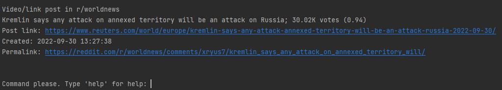
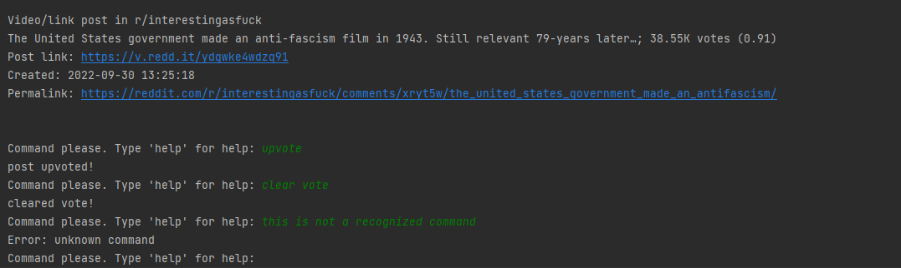

#REDDIT CLI
A Command-Line based Interface for Reddit

#### Table of contents:
[Gallery](#gallery)

[Setup](#set-up)

[Contribute](#contribute)

##Gallery

---



---



---

###Set up
1. In the terminal, type:
```bash
git clone https://github.com/nicola-commits/redditCLI.git
cd redditCLI
#install dependencies
pip install requirements.txt
```
2. create an application on https://www.reddit.com/prefs/apps/.
Be sure to use the `script` option. Every other field can be anything you want.

3. Copy `example.env` and rename it `secrets.env`. Modify its fields, so they match up with your application
where client_id is the one below "personal use script", while secret can be seen by clicking on `edit`.
4. run `python3 main.py` and you're good to go!

###Contribute
Contributions are welcome! Please create a pull request and describe your changes. 
Remember to remove the `secrets.env` file from git before committing 
(or specify that you've changed all of them)